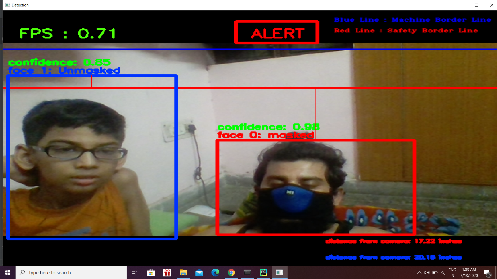

# Mask_detection
The Purpose of this project to detect mask on the face , In the Current Pandemic(Covid). It is paraamount necessary to check the person wearing the mask in the public place or not

# Technology Used

Python=3.6

Tensorflow 1.14 

opencv-python==4.1.0.25

Pycharm

Here I have used FasterRCNN beacuse I just want to start with some basci Object detection algorithm for the Learning purpose , As there are many Objection detection framework have been developed but Many algorithm still uses RCNN in conjunction with other Framework. You are free to use tensorflow object detction model , Just You have to change the Frozen.pb file.

Faster-rcnn is one of the most classic algorithms in the field of object detection. It mainly consists of two parts. One is a deep full convolutional network for generating candidate area frames, and the other is a Fast R-CNN detection model. The two share parameters during training.

Faster R-CNN can solve the problem that Fast RCNN uses the third-party tool selective search to extract the region proposal. It uses RPN instead of selective search to make the entire target detection function into a unified network. Faster RCNN uses RPN to make the calculation of region proposals more elegant and efficient. RPN is a full convolutional network. Candidate region generation and target detection share convolutional features. Attention mechanism is used . RPN will tell the network where to focus.

# Output 

# Thanks

